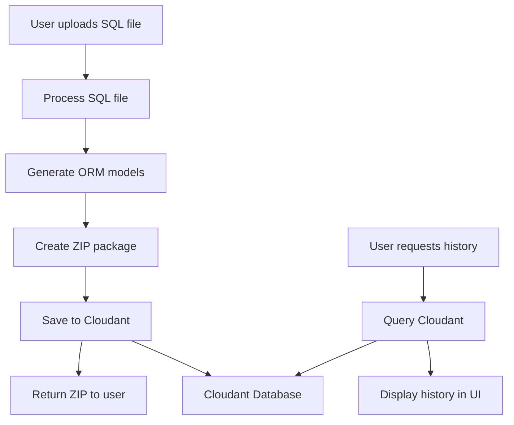

# IBM Cloudant NoSQL Integration Plan for LegacyLink AI

## Overview

This document outlines the step-by-step plan to integrate IBM Cloudant NoSQL database to save and retrieve users' modernization history in the LegacyLink AI project.

## Why IBM Cloudant?

IBM Cloudant is a fully managed, distributed NoSQL database optimized for heavy workloads and fast-growing web and mobile applications. It's ideal for this project because:

- **Serverless**: No infrastructure management required
- **Scalable**: Handles growing user data automatically
- **JSON-based**: Perfect for storing modernization metadata
- **IBM Integration**: Aligns with IBM Bob Hackathon theme
- **Global availability**: Built on Apache CouchDB with multi-region support

---

## Architecture Overview



---

## Data Schema Design

### Document Structure in Cloudant

Each modernization session will be stored as a JSON document:

```json
{
  "_id": "session_2026-05-16T14:35:22_abc123",
  "_rev": "1-xyz",
  "type": "modernization_session",
  "user_id": "anonymous_user_xyz",
  "session_id": "abc123",
  "timestamp": "2026-05-16T14:35:22.293Z",
  "input": {
    "filename": "legacy_customer_schema.sql",
    "file_size": 2048,
    "upload_timestamp": "2026-05-16T14:35:22.293Z"
  },
  "processing": {
    "table_count": 3,
    "column_count": 25,
    "transformation_count": 42,
    "processing_time_ms": 1250
  },
  "output": {
    "tables": [
      {
        "original_name": "tbl_CUST_MSTR_2012_v2",
        "clean_name": "Customer",
        "table_name": "customers",
        "column_count": 8
      }
    ],
    "generated_files": [
      "models.py",
      "database.py",
      "test_models.py",
      "README.md",
      "modernization_report.md",
      "requirements.txt"
    ]
  },
  "transformations": [
    {
      "type": "table_name",
      "original": "tbl_CUST_MSTR_2012_v2",
      "normalized": "Customer",
      "rules_applied": ["remove_prefix", "expand_abbreviation", "remove_version"]
    },
    {
      "type": "column_name",
      "table": "Customer",
      "original": "vch_fname",
      "normalized": "first_name",
      "rules_applied": ["remove_type_prefix", "expand_abbreviation"]
    }
  ],
  "metadata": {
    "app_version": "1.0.0",
    "bob_assisted": true,
    "success": true
  }
}
```

### Index Design

Create indexes for efficient querying:

1. **By User ID**: `user_id` (for retrieving user history)
2. **By Timestamp**: `timestamp` (for chronological sorting)
3. **By Session ID**: `session_id` (for unique session lookup)
4. **By Type**: `type` (for filtering document types)

---

## Implementation Steps

### Step 1: Set Up IBM Cloudant Account

**Prerequisites:**
- IBM Cloud account
- Cloudant service instance

**Actions:**
1. Create IBM Cloud account at https://cloud.ibm.com
2. Create a Cloudant service instance
3. Generate service credentials with appropriate permissions
4. Note down the following credentials:
   - `CLOUDANT_URL`
   - `CLOUDANT_APIKEY`
   - `CLOUDANT_DATABASE_NAME`

**Security Note:** Never commit credentials to Git. Use environment variables or `.env` file (add to `.gitignore`).

---

### Step 2: Install IBM Cloudant SDK

**Update [`requirements.txt`](requirements.txt:1-4):**

```text
streamlit>=1.28.0
pandas>=2.0.0
sqlalchemy>=2.0.0
pytest>=7.0.0
ibmcloudant>=0.7.0
python-dotenv>=1.0.0
```

**Installation command:**
```bash
pip install ibmcloudant python-dotenv
```

---

### Step 3: Create Configuration Management

**Create new file: `.env.example`**

```env
# IBM Cloudant Configuration
CLOUDANT_URL=https://your-instance.cloudantnosqldb.appdomain.cloud
CLOUDANT_APIKEY=your-api-key-here
CLOUDANT_DATABASE_NAME=legacylink_history

# Optional: Enable/disable history tracking
ENABLE_HISTORY_TRACKING=true
```

**Create new file: `config/cloudant_config.py`**

```python
"""
Cloudant configuration management for LegacyLink AI
"""
import os
from dotenv import load_dotenv

# Load environment variables
load_dotenv()

class CloudantConfig:
    """Configuration for IBM Cloudant connection"""
    
    def __init__(self):
        self.url = os.getenv('CLOUDANT_URL')
        self.apikey = os.getenv('CLOUDANT_APIKEY')
        self.database_name = os.getenv('CLOUDANT_DATABASE_NAME', 'legacylink_history')
        self.enabled = os.getenv('ENABLE_HISTORY_TRACKING', 'true').lower() == 'true'
    
    def is_configured(self) -> bool:
        """Check if Cloudant is properly configured"""
        return bool(self.url and self.apikey and self.enabled)
    
    def get_connection_params(self) -> dict:
        """Get connection parameters for Cloudant client"""
        return {
            'url': self.url,
            'apikey': self.apikey
        }
```

---

### Step 4: Create Cloudant Client Module

**Create new file: `storage/cloudant_client.py`**

```python
"""
IBM Cloudant NoSQL client for LegacyLink AI
Handles saving and retrieving modernization history
"""
from typing import Dict, List, Optional
from datetime import datetime
import uuid
from ibmcloudant.cloudant_v1 import CloudantV1, Document
from ibm_cloud_sdk_core.authenticators import IAMAuthenticator
from config.cloudant_config import CloudantConfig


class CloudantClient:
    """Client for IBM Cloudant NoSQL database operations"""
    
    def __init__(self, config: CloudantConfig):
        """
        Initialize Cloudant client
        
        Args:
            config: CloudantConfig instance with connection details
        """
        self.config = config
        self.client = None
        self.database_name = config.database_name
        
        if config.is_configured():
            self._initialize_client()
    
    def _initialize_client(self):
        """Initialize the Cloudant client with authentication"""
        try:
            authenticator = IAMAuthenticator(self.config.apikey)
            self.client = CloudantV1(authenticator=authenticator)
            self.client.set_service_url(self.config.url)
            
            # Ensure database exists
            self._ensure_database_exists()
            
        except Exception as e:
            print(f"Warning: Failed to initialize Cloudant client: {e}")
            self.client = None
    
    def _ensure_database_exists(self):
        """Create database if it doesn't exist"""
        try:
            self.client.get_database_information(db=self.database_name).get_result()
        except Exception:
            # Database doesn't exist, create it
            try:
                self.client.put_database(db=self.database_name).get_result()
                print(f"Created Cloudant database: {self.database_name}")
            except Exception as e:
                print(f"Warning: Failed to create database: {e}")
    
    def save_modernization_session(
        self,
        user_id: str,
        filename: str,
        file_size: int,
        tables: List[Dict],
        transformation_log: List[Dict],
        processing_stats: Dict
    ) -> Optional[str]:
        """
        Save a modernization session to Cloudant
        
        Args:
            user_id: Unique identifier for the user
            filename: Name of uploaded SQL file
            file_size: Size of uploaded file in bytes
            tables: List of parsed and normalized tables
            transformation_log: List of transformations applied
            processing_stats: Statistics about processing
            
        Returns:
            Document ID if successful, None otherwise
        """
        if not self.client:
            return None
        
        try:
            session_id = str(uuid.uuid4())[:8]
            timestamp = datetime.utcnow().isoformat() + 'Z'
            
            document = {
                '_id': f"session_{timestamp}_{session_id}",
                'type': 'modernization_session',
                'user_id': user_id,
                'session_id': session_id,
                'timestamp': timestamp,
                'input': {
                    'filename': filename,
                    'file_size': file_size,
                    'upload_timestamp': timestamp
                },
                'processing': {
                    'table_count': processing_stats.get('table_count', 0),
                    'column_count': processing_stats.get('column_count', 0),
                    'transformation_count': processing_stats.get('transformation_count', 0),
                    'processing_time_ms': processing_stats.get('processing_time_ms', 0)
                },
                'output': {
                    'tables': [
                        {
                            'original_name': table.get('original_name'),
                            'clean_name': table.get('clean_name'),
                            'table_name': table.get('table_name'),
                            'column_count': len(table.get('columns', []))
                        }
                        for table in tables
                    ],
                    'generated_files': [
                        'models.py',
                        'database.py',
                        'test_models.py',
                        'README.md',
                        'modernization_report.md',
                        'requirements.txt'
                    ]
                },
                'transformations': transformation_log,
                'metadata': {
                    'app_version': '1.0.0',
                    'bob_assisted': True,
                    'success': True
                }
            }
            
            response = self.client.post_document(
                db=self.database_name,
                document=document
            ).get_result()
            
            return response.get('id')
            
        except Exception as e:
            print(f"Warning: Failed to save session to Cloudant: {e}")
            return None
    
    def get_user_history(
        self,
        user_id: str,
        limit: int = 10
    ) -> List[Dict]:
        """
        Retrieve modernization history for a user
        
        Args:
            user_id: Unique identifier for the user
            limit: Maximum number of sessions to retrieve
            
        Returns:
            List of session documents
        """
        if not self.client:
            return []
        
        try:
            # Query using Cloudant Query (Mango)
            selector = {
                'type': 'modernization_session',
                'user_id': user_id
            }
            
            response = self.client.post_find(
                db=self.database_name,
                selector=selector,
                sort=[{'timestamp': 'desc'}],
                limit=limit
            ).get_result()
            
            return response.get('docs', [])
            
        except Exception as e:
            print(f"Warning: Failed to retrieve history from Cloudant: {e}")
            return []
    
    def get_session_by_id(self, session_id: str) -> Optional[Dict]:
        """
        Retrieve a specific session by ID
        
        Args:
            session_id: Session identifier
            
        Returns:
            Session document if found, None otherwise
        """
        if not self.client:
            return None
        
        try:
            selector = {
                'type': 'modernization_session',
                'session_id': session_id
            }
            
            response = self.client.post_find(
                db=self.database_name,
                selector=selector,
                limit=1
            ).get_result()
            
            docs = response.get('docs', [])
            return docs[0] if docs else None
            
        except Exception as e:
            print(f"Warning: Failed to retrieve session from Cloudant: {e}")
            return None
    
    def get_statistics(self) -> Dict:
        """
        Get overall statistics from all sessions
        
        Returns:
            Dictionary with aggregate statistics
        """
        if not self.client:
            return {}
        
        try:
            # Get all modernization sessions
            selector = {
                'type': 'modernization_session'
            }
            
            response = self.client.post_find(
                db=self.database_name,
                selector=selector,
                limit=1000  # Adjust based on expected volume
            ).get_result()
            
            docs = response.get('docs', [])
            
            total_sessions = len(docs)
            total_tables = sum(doc.get('processing', {}).get('table_count', 0) for doc in docs)
            total_columns = sum(doc.get('processing', {}).get('column_count', 0) for doc in docs)
            total_transformations = sum(doc.get('processing', {}).get('transformation_count', 0) for doc in docs)
            
            return {
                'total_sessions': total_sessions,
                'total_tables_processed': total_tables,
                'total_columns_normalized': total_columns,
                'total_transformations': total_transformations,
                'unique_users': len(set(doc.get('user_id') for doc in docs))
            }
            
        except Exception as e:
            print(f"Warning: Failed to retrieve statistics from Cloudant: {e}")
            return {}
```

**Create new file: `storage/__init__.py`**

```python
"""Storage module for LegacyLink AI"""
from .cloudant_client import CloudantClient

__all__ = ['CloudantClient']
```

---

### Step 5: Integrate with Main Application

**Update [`app.py`](app.py:27-86) to include Cloudant integration:**

Add imports at the top:
```python
import time
from config.cloudant_config import CloudantConfig
from storage.cloudant_client import CloudantClient
```

Initialize Cloudant client after page config:
```python
# Initialize Cloudant client
cloudant_config = CloudantConfig()
cloudant_client = CloudantClient(cloudant_config) if cloudant_config.is_configured() else None
```

Modify the `process_sql_file` function to track processing time and save to Cloudant:
```python
@st.cache_data(show_spinner=False)
def process_sql_file(sql_content: str, filename: str = "unknown.sql", file_size: int = 0) -> dict | None:
    """Parse SQL and generate all output artefacts. Cached by content hash."""
    start_time = time.time()
    
    try:
        # ... existing parsing code ...
        
        # Calculate processing time
        processing_time_ms = int((time.time() - start_time) * 1000)
        
        # Prepare result
        result = {
            "tables": tables,
            "files": files,
            "zip_data": zip_data,
            "table_count": len(tables),
            "column_count": sum(len(t["columns"]) for t in tables),
            "transformation_count": len(tlog),
            "transformation_log": tlog,
            "processing_time_ms": processing_time_ms,
            "filename": filename,
            "file_size": file_size
        }
        
        return result
        
    except Exception as e:
        st.error(f"Error processing SQL file: {e}")
        return None
```

Add function to save session to Cloudant:
```python
def save_to_cloudant(result: dict, user_id: str):
    """Save modernization session to Cloudant"""
    if not cloudant_client:
        return None
    
    try:
        doc_id = cloudant_client.save_modernization_session(
            user_id=user_id,
            filename=result.get('filename', 'unknown.sql'),
            file_size=result.get('file_size', 0),
            tables=result.get('tables', []),
            transformation_log=result.get('transformation_log', []),
            processing_stats={
                'table_count': result.get('table_count', 0),
                'column_count': result.get('column_count', 0),
                'transformation_count': result.get('transformation_count', 0),
                'processing_time_ms': result.get('processing_time_ms', 0)
            }
        )
        
        if doc_id:
            st.success(f"✅ Session saved to history (ID: {doc_id[:16]}...)")
        
        return doc_id
        
    except Exception as e:
        st.warning(f"Could not save to history: {e}")
        return None
```

---

### Step 6: Add User Session Tracking

**Add to session state initialization in [`app.py`](app.py:100):**

```python
# Generate or retrieve user ID
if 'user_id' not in st.session_state:
    import hashlib
    import socket
    
    # Create a semi-persistent user ID based on session
    session_info = f"{socket.gethostname()}_{st.session_state.get('session_id', 'default')}"
    st.session_state.user_id = hashlib.md5(session_info.encode()).hexdigest()[:16]
```

---

### Step 7: Add History UI Component

**Add new section in Streamlit UI:**

```python
def display_user_history():
    """Display user's modernization history"""
    if not cloudant_client:
        st.info("💡 History tracking is not enabled. Configure Cloudant to enable this feature.")
        return
    
    st.subheader("📜 Your Modernization History")
    
    user_id = st.session_state.get('user_id', 'anonymous')
    history = cloudant_client.get_user_history(user_id, limit=10)
    
    if not history:
        st.info("No history found. Process your first SQL file to start tracking!")
        return
    
    for session in history:
        with st.expander(
            f"🗂️ {session['input']['filename']} - {session['timestamp'][:10]}"
        ):
            col1, col2, col3 = st.columns(3)
            
            with col1:
                st.metric("Tables", session['processing']['table_count'])
            
            with col2:
                st.metric("Columns", session['processing']['column_count'])
            
            with col3:
                st.metric("Transformations", session['processing']['transformation_count'])
            
            st.write("**Generated Tables:**")
            for table in session['output']['tables']:
                st.write(f"- `{table['original_name']}` → `{table['clean_name']}`")
```

Add to sidebar:
```python
with st.sidebar:
    st.title("🔧 Options")
    
    if st.button("📜 View History"):
        st.session_state.show_history = True
    
    if cloudant_client:
        stats = cloudant_client.get_statistics()
        if stats:
            st.divider()
            st.subheader("📊 Global Statistics")
            st.metric("Total Sessions", stats.get('total_sessions', 0))
            st.metric("Tables Processed", stats.get('total_tables_processed', 0))
            st.metric("Unique Users", stats.get('unique_users', 0))
```

---

### Step 8: Error Handling and Fallback

**Implement graceful degradation:**

```python
class CloudantClientWrapper:
    """Wrapper to handle Cloudant operations with fallback"""
    
    def __init__(self, client: Optional[CloudantClient]):
        self.client = client
        self.enabled = client is not None
    
    def save_session(self, *args, **kwargs):
        """Save session with error handling"""
        if not self.enabled:
            return None
        
        try:
            return self.client.save_modernization_session(*args, **kwargs)
        except Exception as e:
            print(f"Cloudant save failed: {e}")
            return None
    
    def get_history(self, *args, **kwargs):
        """Get history with error handling"""
        if not self.enabled:
            return []
        
        try:
            return self.client.get_user_history(*args, **kwargs)
        except Exception as e:
            print(f"Cloudant query failed: {e}")
            return []
```

---

### Step 9: Testing Strategy

**Create test file: `tests/test_cloudant_integration.py`**

```python
"""
Tests for Cloudant integration
"""
import pytest
from unittest.mock import Mock, patch
from storage.cloudant_client import CloudantClient
from config.cloudant_config import CloudantConfig


def test_cloudant_config_validation():
    """Test Cloudant configuration validation"""
    config = CloudantConfig()
    
    # Should handle missing credentials gracefully
    assert isinstance(config.is_configured(), bool)


def test_cloudant_client_initialization():
    """Test Cloudant client initialization"""
    config = Mock()
    config.is_configured.return_value = False
    
    client = CloudantClient(config)
    assert client.client is None


@patch('storage.cloudant_client.CloudantV1')
def test_save_modernization_session(mock_cloudant):
    """Test saving a modernization session"""
    config = Mock()
    config.is_configured.return_value = True
    config.url = "https://test.cloudant.com"
    config.apikey = "test-key"
    config.database_name = "test-db"
    
    client = CloudantClient(config)
    
    # Mock successful save
    mock_cloudant.return_value.post_document.return_value.get_result.return_value = {
        'id': 'test-doc-id',
        'rev': '1-abc'
    }
    
    doc_id = client.save_modernization_session(
        user_id="test-user",
        filename="test.sql",
        file_size=1024,
        tables=[],
        transformation_log=[],
        processing_stats={}
    )
    
    assert doc_id is not None


def test_graceful_degradation_without_cloudant():
    """Test that app works without Cloudant configured"""
    config = CloudantConfig()
    config.enabled = False
    
    client = CloudantClient(config)
    
    # Should return None/empty without errors
    assert client.save_modernization_session(
        user_id="test",
        filename="test.sql",
        file_size=100,
        tables=[],
        transformation_log=[],
        processing_stats={}
    ) is None
    
    assert client.get_user_history("test") == []
```

---

### Step 10: Documentation Updates

**Update [`README.md`](README.md) with Cloudant setup instructions:**

Add new section:

```markdown
## 🗄️ Optional: Enable History Tracking with IBM Cloudant

LegacyLink AI can save your modernization history to IBM Cloudant NoSQL database.

### Setup Steps

1. **Create IBM Cloud Account**
   - Visit https://cloud.ibm.com
   - Sign up for a free account

2. **Create Cloudant Service**
   - Navigate to Catalog → Databases → Cloudant
   - Create a new instance (Lite plan is free)
   - Generate service credentials

3. **Configure Environment Variables**
   - Copy `.env.example` to `.env`
   - Add your Cloudant credentials:
     ```env
     CLOUDANT_URL=https://your-instance.cloudantnosqldb.appdomain.cloud
     CLOUDANT_APIKEY=your-api-key-here
     CLOUDANT_DATABASE_NAME=legacylink_history
     ENABLE_HISTORY_TRACKING=true
     ```

4. **Install Dependencies**
   ```bash
   pip install -r requirements.txt
   ```

5. **Run Application**
   ```bash
   streamlit run app.py
   ```

### Features with History Tracking

- ✅ Save every modernization session
- ✅ View your processing history
- ✅ Track transformations over time
- ✅ Global usage statistics
- ✅ Session replay capability

### Privacy Note

User IDs are generated as anonymous hashes. No personal information is stored unless explicitly provided.
```

---

## Security Considerations

1. **Credential Management**
   - Never commit `.env` file to Git
   - Add `.env` to `.gitignore`
   - Use environment variables in production
   - Rotate API keys regularly

2. **Data Privacy**
   - Generate anonymous user IDs
   - Don't store actual SQL file contents (only metadata)
   - Implement data retention policies
   - Provide user data deletion option

3. **Access Control**
   - Use IAM authentication
   - Limit API key permissions to specific database
   - Enable audit logging in Cloudant
   - Monitor for unusual access patterns

---

## Deployment Considerations

### Streamlit Cloud Deployment

Add secrets in Streamlit Cloud dashboard:
```toml
[cloudant]
url = "https://your-instance.cloudantnosqldb.appdomain.cloud"
apikey = "your-api-key"
database_name = "legacylink_history"
```

Access in code:
```python
import streamlit as st

cloudant_url = st.secrets.get("cloudant", {}).get("url")
cloudant_apikey = st.secrets.get("cloudant", {}).get("apikey")
```

### Local Development

Use `.env` file for local development:
```bash
cp .env.example .env
# Edit .env with your credentials
```

---

## Cost Estimation

**IBM Cloudant Lite Plan (Free):**
- 1 GB storage
- 20 lookups/sec
- 10 writes/sec
- Suitable for MVP and demo

**Standard Plan (Pay-as-you-go):**
- $0.25/GB storage per month
- $0.015 per 100 reads
- $0.015 per 100 writes
- Scale as needed

For hackathon demo: **Lite plan is sufficient**

---

## Testing Checklist

- [ ] Cloudant client initializes correctly
- [ ] Database is created automatically
- [ ] Sessions are saved successfully
- [ ] History retrieval works
- [ ] Statistics calculation is accurate
- [ ] Error handling works without Cloudant
- [ ] App works with Cloudant disabled
- [ ] No credentials in Git repository
- [ ] Documentation is complete
- [ ] UI displays history correctly

---

## Future Enhancements

1. **Advanced Analytics**
   - Most common table patterns
   - Transformation effectiveness metrics
   - Processing time trends

2. **User Features**
   - Export history as JSON
   - Share sessions with team
   - Compare different modernization approaches

3. **Integration**
   - GitHub integration for direct commits
   - Slack notifications for completed sessions
   - API endpoint for programmatic access

4. **Performance**
   - Implement caching layer
   - Batch operations for bulk saves
   - Optimize query indexes

---

## Summary

This integration plan provides a complete roadmap for adding IBM Cloudant NoSQL database to LegacyLink AI. The implementation:

✅ Saves modernization history automatically  
✅ Provides user history viewing  
✅ Tracks global statistics  
✅ Handles errors gracefully  
✅ Works without Cloudant (optional feature)  
✅ Follows security best practices  
✅ Includes comprehensive testing  
✅ Provides clear documentation  

The integration enhances the project while maintaining the core functionality and aligning with the IBM Bob Hackathon theme.