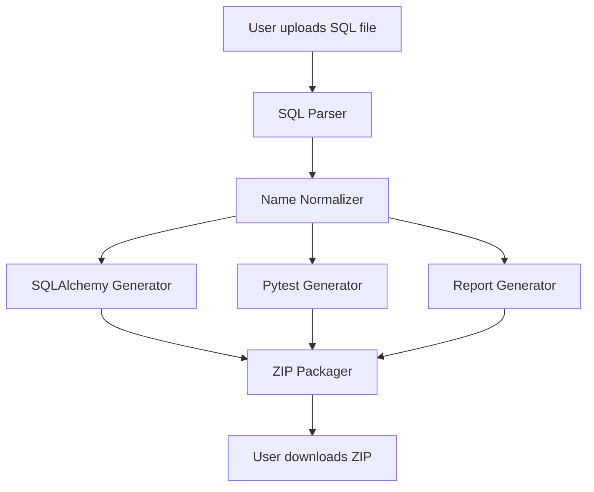

# LegacyLink AI Implementation Plan

## Overview
Implement complete LegacyLink AI functionality with Google Stitch design system in Streamlit.

## Architecture



## Module Structure

### 1. SQL Parser (`parser/sql_parser.py`)
**Purpose**: Extract schema metadata from SQL DDL files

**Key Functions**:
- `parse_sql_file(sql_content)` - Main parsing function
- `_remove_comments(sql_content)` - Strip SQL comments
- `_parse_columns(columns_def)` - Extract column definitions
- `_parse_column_definition(column_def)` - Parse individual column

**Output Format**:
```python
{
    'original_name': 'tbl_CUST_MSTR_2012_v2',
    'columns': [
        {
            'original_name': 'c_id',
            'type': 'INT',
            'size': None,
            'primary_key': True,
            'nullable': False,
            'has_default': False
        }
    ]
}
```

### 2. Name Normalizer (`parser/name_normalizer.py`)
**Purpose**: Clean legacy table and column names

**Abbreviation Dictionary**:
- `tbl_` → remove prefix
- `CUST` → `Customer`
- `MSTR` → `Master`
- `STR` → `Store`
- `ORD` → `Order`
- `DTL` → `Detail`
- `c_id` → `id`
- `vch_fname` → `first_name`
- `vch_lname` → `last_name`
- `vch_email` → `email`
- `fk_` → remove prefix (foreign key)
- `dt_upd_dt` → `updated_at`
- `dt_crt_dt` → `created_at`
- `int_status` → `status`
- `dec_amt` → `amount`
- `int_qty` → `quantity`

**Key Functions**:
- `normalize_table_name(table_name)` - Convert to clean class name
- `normalize_column_name(column_name)` - Convert to clean attribute name
- `get_transformation_log()` - Track all changes for report

### 3. SQLAlchemy Generator (`generator/model_generator.py`)
**Purpose**: Generate SQLAlchemy 2.0 ORM models

**Type Mapping**:
- `INT/INTEGER` → `Integer`
- `VARCHAR(n)` → `String(n)`
- `TEXT` → `Text`
- `TIMESTAMP/DATETIME` → `DateTime`
- `DATE` → `Date`
- `BOOLEAN/BOOL` → `Boolean`
- `DECIMAL/NUMERIC` → `Numeric`
- `FLOAT/DOUBLE` → `Float`

**Output**: `models.py` with SQLAlchemy classes

### 4. Pytest Generator (`generator/test_generator.py`)
**Purpose**: Create starter pytest test files

**Test Types**:
- Table name verification
- Primary key existence
- Column existence
- Column type validation

**Output**: `test_models.py`

### 5. Report Generator (`generator/report_generator.py`)
**Purpose**: Create modernization documentation

**Outputs**:
- `README.md` - Installation and usage instructions
- `modernization_report.md` - Transformation details
- `requirements.txt` - Python dependencies

### 6. Database Setup (`generator/database_generator.py`)
**Purpose**: Generate base SQLAlchemy configuration

**Output**: `database.py` with Base class

### 7. ZIP Packager (`generator/zip_packager.py`)
**Purpose**: Package all generated files into downloadable ZIP

**Structure**:
```
generated_project/
├── models.py
├── database.py
├── test_models.py
├── README.md
├── modernization_report.md
└── requirements.txt
```

## Streamlit App Integration

### UI Components (Google Stitch Design)

1. **Hero Section**
   - Title with neon cyan accent
   - Description text
   - CTA buttons

2. **Upload Area**
   - Drag & drop zone with cyber glow
   - File browser button
   - Supported formats display

3. **Preview Terminal**
   - Terminal-style output window
   - Real-time processing status
   - Matrix green status messages

4. **Results Section** (after processing)
   - Parsed schema preview
   - Generated model preview
   - Modernization report preview
   - Download ZIP button

5. **Metrics Display**
   - Tables processed
   - Columns normalized
   - Tests generated

### Processing Flow

1. User uploads SQL file
2. Display parsing status in terminal
3. Show parsed schema in expandable sections
4. Display generated models preview
5. Show modernization report
6. Provide ZIP download button

## Implementation Steps

1. ✅ Create SQL parser module
2. ✅ Create name normalizer module
3. ✅ Create SQLAlchemy model generator
4. ✅ Create pytest test generator
5. ✅ Create report generators
6. ✅ Create database generator
7. ✅ Create ZIP packager
8. ✅ Integrate into Streamlit app
9. ✅ Test with example SQL file
10. ✅ Verify all components working

## Testing Strategy

Use `examples/legacy_customer_schema.sql` as test input:
- 3 tables: Customer, Store, Order
- Various column types
- Primary keys
- Foreign key references

Expected output:
- Clean model names: `Customer`, `Store`, `Order`
- Normalized columns
- Complete test suite
- Detailed modernization report

## Success Criteria

- ✅ SQL file successfully parsed
- ✅ All tables and columns extracted
- ✅ Names properly normalized
- ✅ Valid SQLAlchemy models generated
- ✅ Pytest tests created
- ✅ Documentation generated
- ✅ ZIP file downloadable
- ✅ Google Stitch design implemented
- ✅ All UI components functional