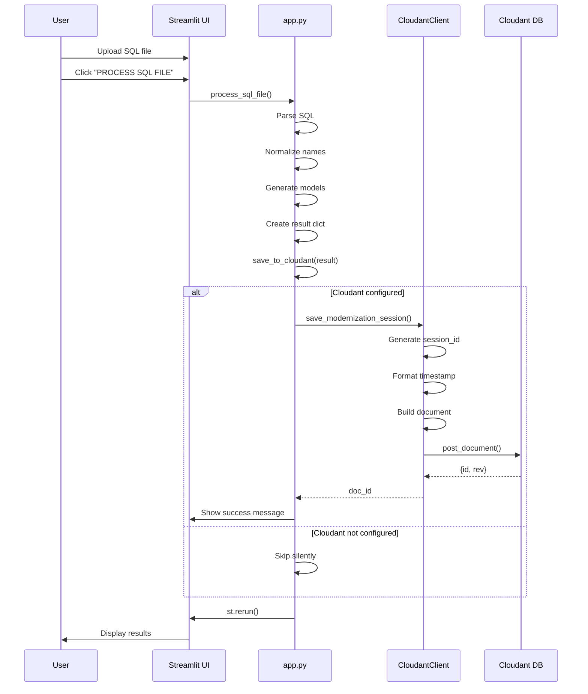
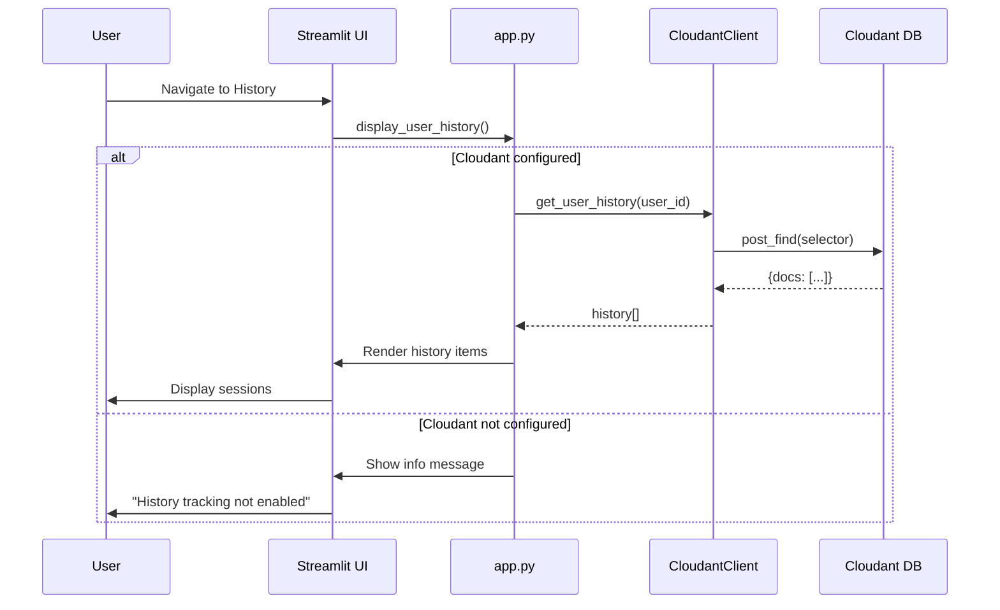

# IBM Cloudant Integration Technical Documentation

This document provides technical details about the IBM Cloudant NoSQL database integration in LegacyLink AI.

## Table of Contents

- [Architecture Overview](#architecture-overview)
- [Data Flow](#data-flow)
- [Component Details](#component-details)
- [API Reference](#api-reference)
- [Session Document Schema](#session-document-schema)
- [Query Patterns](#query-patterns)
- [Error Handling](#error-handling)
- [Performance Considerations](#performance-considerations)
- [Testing](#testing)
- [Development Guidelines](#development-guidelines)

---

## Architecture Overview

LegacyLink AI uses IBM Cloudant as an optional NoSQL database for storing modernization session history. The integration follows a layered architecture:

```
┌─────────────────────────────────────────────────────────────┐
│                     Streamlit UI (app.py)                   │
│  - File upload handling                                     │
│  - User interaction                                         │
│  - Session state management                                 │
└────────────────────────┬────────────────────────────────────┘
                         │
                         ▼
┌─────────────────────────────────────────────────────────────┐
│              Application Layer (app.py)                     │
│  - save_to_cloudant()                                       │
│  - display_user_history()                                   │
│  - Session data preparation                                 │
└────────────────────────┬────────────────────────────────────┘
                         │
                         ▼
┌─────────────────────────────────────────────────────────────┐
│         Storage Layer (storage/cloudant_client.py)          │
│  - CloudantClient class                                     │
│  - CRUD operations                                          │
│  - Query methods                                            │
└────────────────────────┬────────────────────────────────────┘
                         │
                         ▼
┌─────────────────────────────────────────────────────────────┐
│      Configuration Layer (config/cloudant_config.py)        │
│  - CloudantConfig class                                     │
│  - Environment variable loading                             │
│  - Validation logic                                         │
└────────────────────────┬────────────────────────────────────┘
                         │
                         ▼
┌─────────────────────────────────────────────────────────────┐
│              IBM Cloudant NoSQL Database                    │
│  - Document storage                                         │
│  - Indexing and querying                                    │
│  - Replication and backup                                   │
└─────────────────────────────────────────────────────────────┘
```

### Design Principles

1. **Optional Integration**: App works without Cloudant configured
2. **Graceful Degradation**: Failures don't break the main workflow
3. **Separation of Concerns**: Clear layer boundaries
4. **Testability**: Fully mocked for unit testing
5. **Security**: Credentials via environment variables only

---

## Data Flow

### Session Save Flow



### History Retrieval Flow



---

## Component Details

### 1. CloudantConfig (`config/cloudant_config.py`)

**Purpose**: Manages Cloudant connection configuration

**Key Methods**:
- `__init__()`: Loads environment variables
- `is_configured()`: Validates configuration completeness
- `get_connection_params()`: Returns connection dictionary

**Environment Variables**:
```python
CLOUDANT_URL              # Required: Service URL
CLOUDANT_APIKEY           # Required: IAM API key
CLOUDANT_DATABASE_NAME    # Optional: Default 'legacylink_history'
ENABLE_HISTORY_TRACKING   # Optional: Default 'true'
```

**Example Usage**:
```python
from config.cloudant_config import CloudantConfig

config = CloudantConfig()
if config.is_configured():
    print(f"Cloudant URL: {config.url}")
    print(f"Database: {config.database_name}")
```

---

### 2. CloudantClient (`storage/cloudant_client.py`)

**Purpose**: Handles all Cloudant database operations

**Initialization**:
```python
from storage.cloudant_client import CloudantClient
from config.cloudant_config import CloudantConfig

config = CloudantConfig()
client = CloudantClient(config) if config.is_configured() else None
```

**Key Features**:
- Automatic database creation
- IAM authentication
- Error handling with graceful degradation
- Query optimization

---

### 3. Application Integration (`app.py`)

**Initialization** (lines 131-132):
```python
cloudant_config = CloudantConfig()
cloudant_client = CloudantClient(cloudant_config) if cloudant_config.is_configured() else None
```

**Session Saving** (line 879):
```python
# After successful SQL processing
save_to_cloudant(result, st.session_state.user_id)
```

**Helper Function** (lines 134-161):
```python
def save_to_cloudant(result: dict, user_id: str):
    """Save modernization session to Cloudant"""
    if not cloudant_client:
        return None
    
    try:
        doc_id = cloudant_client.save_modernization_session(
            user_id=user_id,
            filename=result.get('filename', 'unknown.sql'),
            file_size=result.get('file_size', 0),
            tables=result.get('tables', []),
            transformation_log=result.get('transformation_log', []),
            processing_stats={...}
        )
        
        if doc_id:
            st.success(f"✅ Session saved to history (ID: {doc_id[:16]}...)")
        
        return doc_id
        
    except Exception as e:
        st.warning(f"Could not save to history: {e}")
        return None
```

---

## API Reference

### CloudantClient Methods

#### `save_modernization_session()`

Saves a modernization session to Cloudant.

**Signature**:
```python
def save_modernization_session(
    self,
    user_id: str,
    filename: str,
    file_size: int,
    tables: List[Dict],
    transformation_log: List[Dict],
    processing_stats: Dict
) -> Optional[str]
```

**Parameters**:
- `user_id` (str): Unique identifier for the user
- `filename` (str): Name of uploaded SQL file
- `file_size` (int): Size of file in bytes
- `tables` (List[Dict]): Parsed and normalized table definitions
- `transformation_log` (List[Dict]): List of transformations applied
- `processing_stats` (Dict): Processing metrics

**Returns**:
- `str`: Document ID if successful
- `None`: If Cloudant not configured or error occurred

**Example**:
```python
doc_id = client.save_modernization_session(
    user_id="user123",
    filename="legacy_schema.sql",
    file_size=2048,
    tables=[{
        'original_name': 'tbl_CUST',
        'clean_name': 'Customer',
        'table_name': 'customers',
        'columns': [...]
    }],
    transformation_log=[{
        'type': 'table_rename',
        'original': 'tbl_CUST',
        'normalized': 'Customer'
    }],
    processing_stats={
        'table_count': 3,
        'column_count': 25,
        'transformation_count': 50,
        'processing_time_ms': 500
    }
)
```

---

#### `get_user_history()`

Retrieves modernization history for a specific user.

**Signature**:
```python
def get_user_history(
    self,
    user_id: str,
    limit: int = 10
) -> List[Dict]
```

**Parameters**:
- `user_id` (str): User identifier
- `limit` (int): Maximum number of sessions to retrieve (default: 10)

**Returns**:
- `List[Dict]`: List of session documents, sorted by timestamp (newest first)
- `[]`: Empty list if no history or Cloudant not configured

**Example**:
```python
history = client.get_user_history("user123", limit=5)
for session in history:
    print(f"File: {session['input']['filename']}")
    print(f"Tables: {session['processing']['table_count']}")
    print(f"Time: {session['timestamp']}")
```

---

#### `get_session_by_id()`

Retrieves a specific session by its session ID.

**Signature**:
```python
def get_session_by_id(self, session_id: str) -> Optional[Dict]
```

**Parameters**:
- `session_id` (str): 8-character session identifier

**Returns**:
- `Dict`: Session document if found
- `None`: If not found or Cloudant not configured

**Example**:
```python
session = client.get_session_by_id("abc12345")
if session:
    print(f"Found session from {session['timestamp']}")
```

---

#### `get_statistics()`

Retrieves aggregate statistics across all sessions.

**Signature**:
```python
def get_statistics(self) -> Dict
```

**Returns**:
- `Dict`: Statistics dictionary with keys:
  - `total_sessions`: Total number of sessions
  - `total_tables_processed`: Sum of all tables processed
  - `total_columns_normalized`: Sum of all columns normalized
  - `total_transformations`: Sum of all transformations
  - `unique_users`: Count of unique user IDs
- `{}`: Empty dict if Cloudant not configured

**Example**:
```python
stats = client.get_statistics()
print(f"Total sessions: {stats['total_sessions']}")
print(f"Unique users: {stats['unique_users']}")
```

---

## Session Document Schema

### Document Structure

```json
{
  "_id": "session_2026-05-17T02:43:00.000000Z_abc12345",
  "_rev": "1-abc123...",
  "type": "modernization_session",
  "user_id": "user-identifier",
  "session_id": "abc12345",
  "timestamp": "2026-05-17T02:43:00.000000Z",
  
  "input": {
    "filename": "legacy_customer_schema.sql",
    "file_size": 2048,
    "upload_timestamp": "2026-05-17T02:43:00.000000Z"
  },
  
  "processing": {
    "table_count": 3,
    "column_count": 25,
    "transformation_count": 50,
    "processing_time_ms": 500
  },
  
  "output": {
    "tables": [
      {
        "original_name": "tbl_CUST_MSTR_2012_v2",
        "clean_name": "Customer",
        "table_name": "customers",
        "column_count": 8
      }
    ],
    "generated_files": [
      "models.py",
      "database.py",
      "test_models.py",
      "README.md",
      "modernization_report.md",
      "requirements.txt"
    ]
  },
  
  "transformations": [
    {
      "type": "table_rename",
      "original": "tbl_CUST_MSTR_2012_v2",
      "normalized": "Customer",
      "reason": "Removed prefix and version suffix"
    },
    {
      "type": "column_rename",
      "table": "Customer",
      "original": "vch_fname",
      "normalized": "first_name",
      "reason": "Expanded abbreviation and removed type prefix"
    }
  ],
  
  "metadata": {
    "app_version": "1.0.0",
    "bob_assisted": true,
    "success": true
  }
}
```

### Field Descriptions

| Field | Type | Description |
|-------|------|-------------|
| `_id` | string | Unique document ID (format: `session_{timestamp}_{session_id}`) |
| `_rev` | string | Cloudant revision ID (managed by Cloudant) |
| `type` | string | Document type identifier (always `"modernization_session"`) |
| `user_id` | string | User identifier (from session state) |
| `session_id` | string | 8-character unique session identifier |
| `timestamp` | string | ISO 8601 UTC timestamp of session creation |
| `input.filename` | string | Original SQL filename |
| `input.file_size` | integer | File size in bytes |
| `input.upload_timestamp` | string | ISO 8601 UTC timestamp of upload |
| `processing.table_count` | integer | Number of tables processed |
| `processing.column_count` | integer | Total columns across all tables |
| `processing.transformation_count` | integer | Number of transformations applied |
| `processing.processing_time_ms` | integer | Processing time in milliseconds |
| `output.tables` | array | Simplified table information |
| `output.generated_files` | array | List of generated file names |
| `transformations` | array | Detailed transformation log |
| `metadata.app_version` | string | Application version |
| `metadata.bob_assisted` | boolean | Whether IBM Bob was used |
| `metadata.success` | boolean | Whether processing succeeded |

---

## Query Patterns

### 1. Find User Sessions

```python
selector = {
    'type': 'modernization_session',
    'user_id': 'user123'
}

response = client.client.post_find(
    db=database_name,
    selector=selector,
    sort=[{'timestamp': 'desc'}],
    limit=10
).get_result()

sessions = response.get('docs', [])
```

### 2. Find Sessions by Date Range

```python
selector = {
    'type': 'modernization_session',
    'timestamp': {
        '$gte': '2026-05-01T00:00:00.000000Z',
        '$lte': '2026-05-31T23:59:59.999999Z'
    }
}
```

### 3. Find Sessions with High Table Count

```python
selector = {
    'type': 'modernization_session',
    'processing.table_count': {'$gte': 10}
}
```

### 4. Aggregate Statistics

```python
# Get all sessions
selector = {'type': 'modernization_session'}
response = client.client.post_find(
    db=database_name,
    selector=selector,
    limit=1000
).get_result()

docs = response.get('docs', [])

# Calculate aggregates
total_tables = sum(doc.get('processing', {}).get('table_count', 0) for doc in docs)
avg_processing_time = sum(doc.get('processing', {}).get('processing_time_ms', 0) for doc in docs) / len(docs)
```

---

## Error Handling

### Strategy

The integration uses **graceful degradation**:

1. **Configuration Errors**: App continues without Cloudant
2. **Connection Errors**: Warning shown, processing continues
3. **Save Errors**: Warning shown, user can still download results
4. **Query Errors**: Empty results returned, no crash

### Error Scenarios

#### 1. Cloudant Not Configured

```python
if not cloudant_client:
    st.info("💡 History tracking is not enabled. Configure Cloudant to enable this feature.")
    return
```

**User Impact**: No history tracking, app works normally

#### 2. Authentication Failure

```python
try:
    authenticator = IAMAuthenticator(self.config.apikey)
    self.client = CloudantV1(authenticator=authenticator)
except Exception as e:
    print(f"Warning: Failed to initialize Cloudant client: {e}")
    self.client = None
```

**User Impact**: Warning in console, app continues

#### 3. Save Failure

```python
try:
    doc_id = cloudant_client.save_modernization_session(...)
    if doc_id:
        st.success(f"✅ Session saved to history")
    return doc_id
except Exception as e:
    st.warning(f"Could not save to history: {e}")
    return None
```

**User Impact**: Warning message, results still available

#### 4. Query Failure

```python
try:
    response = self.client.post_find(...)
    return response.get('docs', [])
except Exception as e:
    print(f"Warning: Failed to retrieve history: {e}")
    return []
```

**User Impact**: Empty history shown, no crash

---

## Performance Considerations

### Document Size

- **Typical session**: 5-50 KB
- **Large session** (100+ tables): 100-500 KB
- **Recommendation**: Monitor document sizes, consider compression for very large schemas

### Query Performance

- **Indexed fields**: `type`, `user_id`, `timestamp`
- **Query limit**: Default 10 sessions per user
- **Recommendation**: Create indexes for frequently queried fields

### Rate Limits

**Lite Plan**:
- 20 lookups/second
- 10 writes/second
- 1 GB storage

**Standard Plan**:
- Provisioned capacity units
- Scalable based on needs

### Optimization Tips

1. **Batch Operations**: Group multiple saves if processing multiple files
2. **Selective Fields**: Only store necessary data
3. **Compression**: Consider compressing large transformation logs
4. **Pagination**: Implement pagination for history views
5. **Caching**: Cache frequently accessed sessions

---

## Testing

### Unit Tests

Location: `tests/test_cloudant_integration.py`

**Test Coverage**:
- Configuration validation
- Client initialization
- Session saving
- History retrieval
- Statistics calculation
- Error handling
- Graceful degradation

**Run Tests**:
```bash
# All tests
pytest tests/test_cloudant_integration.py -v

# Specific test
pytest tests/test_cloudant_integration.py::test_save_modernization_session -v

# With coverage
pytest tests/test_cloudant_integration.py --cov=storage --cov=config
```

### Integration Testing

**Manual Test Checklist**:

1. ✅ Upload SQL file without Cloudant configured
2. ✅ Configure Cloudant and restart app
3. ✅ Upload SQL file and verify session saved
4. ✅ Check Cloudant dashboard for document
5. ✅ View history in app (if UI implemented)
6. ✅ Test with invalid credentials
7. ✅ Test with network disconnected
8. ✅ Test with large SQL file (>1MB)

---

## Development Guidelines

### Adding New Fields to Session Document

1. **Update Schema** in `save_modernization_session()`:
   ```python
   document = {
       # ... existing fields ...
       'new_field': new_value
   }
   ```

2. **Update Tests**:
   ```python
   def test_new_field_saved():
       # Test that new field is saved correctly
       pass
   ```

3. **Update Documentation**: Add field to schema section

### Adding New Query Methods

1. **Add Method** to `CloudantClient`:
   ```python
   def get_sessions_by_criteria(self, criteria: Dict) -> List[Dict]:
       """Get sessions matching criteria"""
       if not self.client:
           return []
       
       try:
           selector = {'type': 'modernization_session', **criteria}
           response = self.client.post_find(
               db=self.database_name,
               selector=selector
           ).get_result()
           return response.get('docs', [])
       except Exception as e:
           print(f"Warning: Query failed: {e}")
           return []
   ```

2. **Add Tests**:
   ```python
   def test_get_sessions_by_criteria():
       # Test new query method
       pass
   ```

3. **Document API**: Add to API Reference section

### Best Practices

1. **Always check `if not self.client`** before operations
2. **Use try-except** for all Cloudant operations
3. **Return sensible defaults** on errors (None, [], {})
4. **Log warnings** but don't crash
5. **Test graceful degradation** scenarios
6. **Document all public methods**
7. **Keep documents under 1MB** when possible
8. **Use ISO 8601 UTC** for all timestamps

---

## Troubleshooting

### Debug Mode

Enable debug logging:
```python
import logging
logging.basicConfig(level=logging.DEBUG)
```

### Common Issues

1. **"Database not found"**: Auto-creation failed, create manually
2. **"Authentication failed"**: Check API key and URL
3. **"Rate limit exceeded"**: Upgrade plan or reduce frequency
4. **"Document too large"**: Reduce transformation log detail

### Monitoring

Check these metrics:
- Document count in database
- Average document size
- Query response times
- Error rates in logs
- Storage usage in IBM Cloud dashboard

---

## References

- [IBM Cloudant Documentation](https://cloud.ibm.com/docs/Cloudant)
- [Cloudant Python SDK](https://github.com/IBM/cloudant-python-sdk)
- [Cloudant Query (Mango)](https://cloud.ibm.com/docs/Cloudant?topic=Cloudant-query)
- [IBM Cloud IAM](https://cloud.ibm.com/docs/account?topic=account-iamoverview)

---

**Made with IBM Bob** 🤖